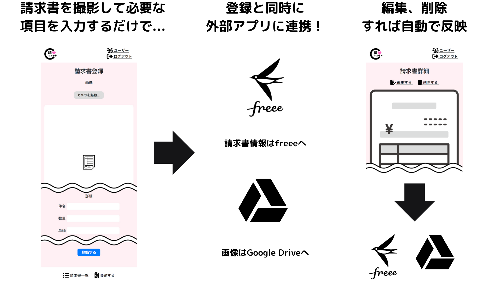
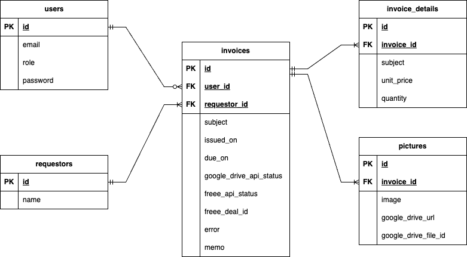

# 請求書管理アプリ「請キュート」
インターン先企業の要望を受けて、自社に届く請求書を一元管理するアプリケーションを開発しました！

▼**サービス URL**

https://boiling-earth-04784-9dfd8063f145.herokuapp.com

## なぜこのサービスが必要なのか
インターン先の企業では、毎月自社に届く請求書の管理を以下の流れで対応しています。
1. プリンターでスキャン→PCの所定のフォルダに保存
1. そのデータをGoogle Driveにアップロード
1. アップしたデータをスプレッドシートに転記
1. それを会計士に送付
1. 会計士がクラウド会計ソフト「freee」に登録
1. 会計士が振込みを実施

ですが、現状は次のような問題点があります。
- 毎月数十枚の請求書が紙で届くため、1枚1枚スキャンして保存し、Google Driveにアップロードするのが大変。
- スプレッドシートに項目を転記しているが、入力が大変。
- シートに転記した内容を会計士に連携し、支払いのためにfreeeへ入力してもらっているが、シンプルな運用に変えたい。

アプリで管理と連携を一元化すれば、今まで実施していた請求書のスキャンやスプレッドシートへの入力、会計士やクラウド会計ソフトへの連携、といった毎月の請求書対応にかかる工数を削減できるため、請キュートの開発に着手しました。

## 使い方
以下の通りシンプルです！ (スマートフォンやタブレットなどカメラ付きモバイル機器での利用を想定しています。PCでの利用も可能です。)

## 主な機能
- 未ログインユーザー
  - ログイン機能
- 一般ユーザー
  - ログアウト機能
  - 請求書管理(登録・一覧・詳細)
  - 請求書登録時に画像をGoogle Driveへ連携する機能
  - 請求書登録時に請求書情報をfreeeへ連携する機能
  - 請求元管理(登録・一覧)
- 管理ユーザー
  - ユーザー管理(登録・一覧・編集・更新・削除)
  - 請求書管理(登録・一覧・詳細・編集・更新・削除)
  - 請求書登録、更新、削除と連動してGoogle Driveへ画像を登録、更新、削除する機能
  - 請求書登録、更新、削除と連動して請求書情報をfreeeへ登録、更新、削除する機能
  - 請求元管理(登録・一覧・編集・更新・削除)

## 今後追加したい機能
- 請求書登録、更新、削除時のAPI連携部分のジョブ化
- 請求書登録画面で金額入力に応じた小計・合計の自動計算機能
- 請求書登録時のアップロード画像をOCRで文字認識し、項目手入力の負担を減らす機能
- ユーザーを所属会社ごとにグループ化する機能
- 会社ごとに画像や請求書情報の外部連携先をカスタマイズできる機能

## 主な使用技術
**【バックエンド】**
- Ruby on Rails（6.1.7.6）
- Ruby（3.0.1）

**【フロントエンド】**
- JavaScript
- Bootstrap

**【Gem】**
- carrierwave
- cocoon
- socery
- google_drive

**【API】**
- Google Drive API
- freee API

**【インフラ】**
- heroku

## E-R図
